# Pastebin
Система, в которой пользователи могут создавать посты и делиться ссылками на них с другими пользователями
## Функционал
* Пользователь может создать блок текста и сохранить его в систему
* Формируются короткие и уникальные ссылки к постам
* Блоки текста и ссылки удаляются из системы через определенное время и автор может сам это настроить
* Пользователь может отправить ссылку на блок текста или свой профиль другому человеку

## Сайт
[Главная страница](http://188.225.78.31/) 
[Мой профиль](http://188.225.78.31/profile?u=Almaz)

## Интерфейс
### Mobile
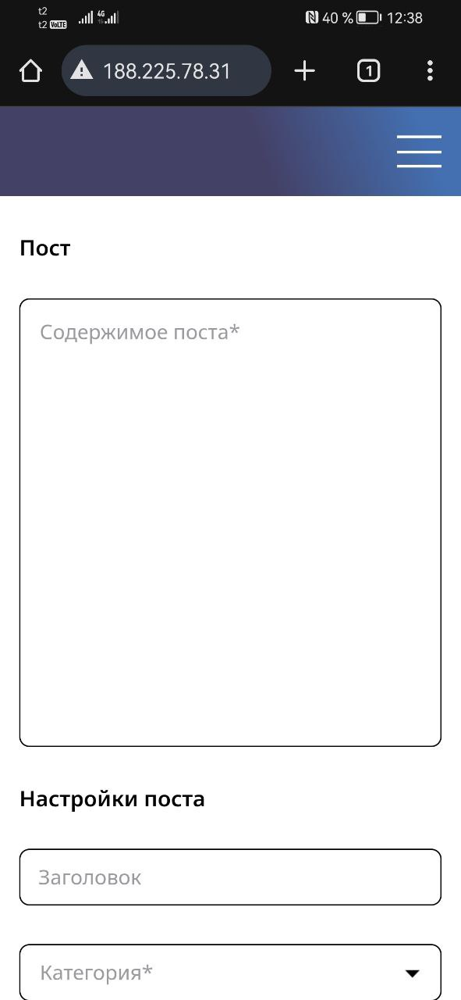
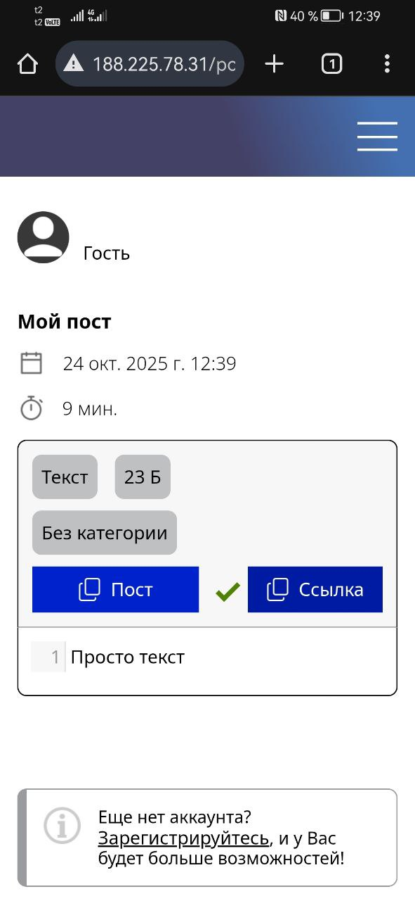
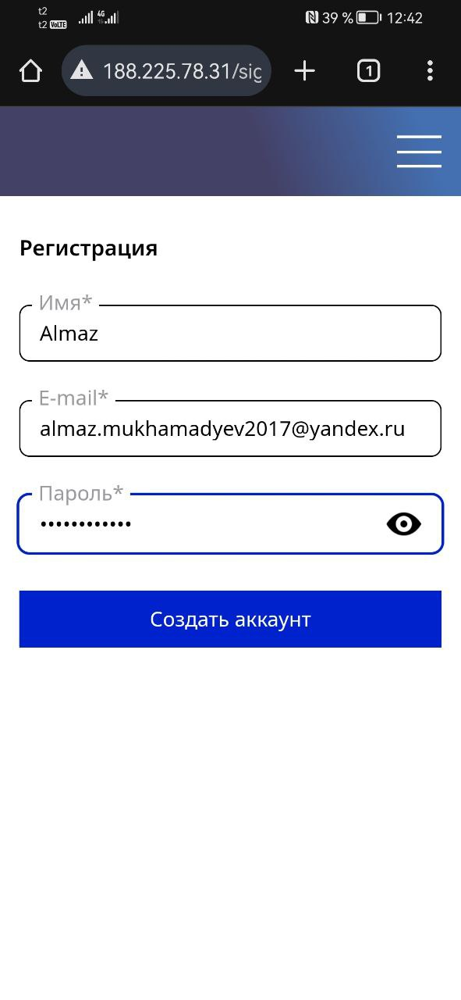
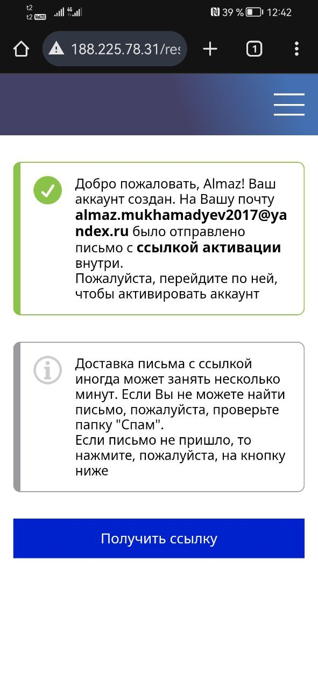
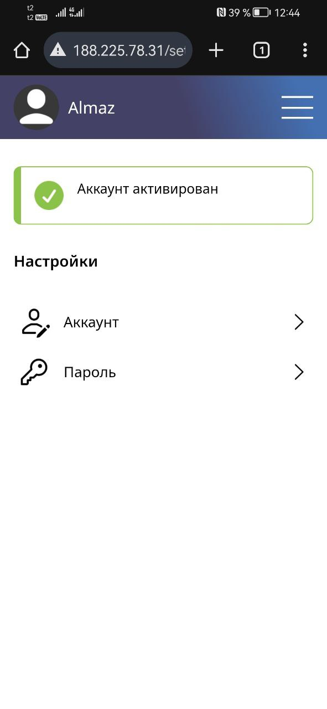
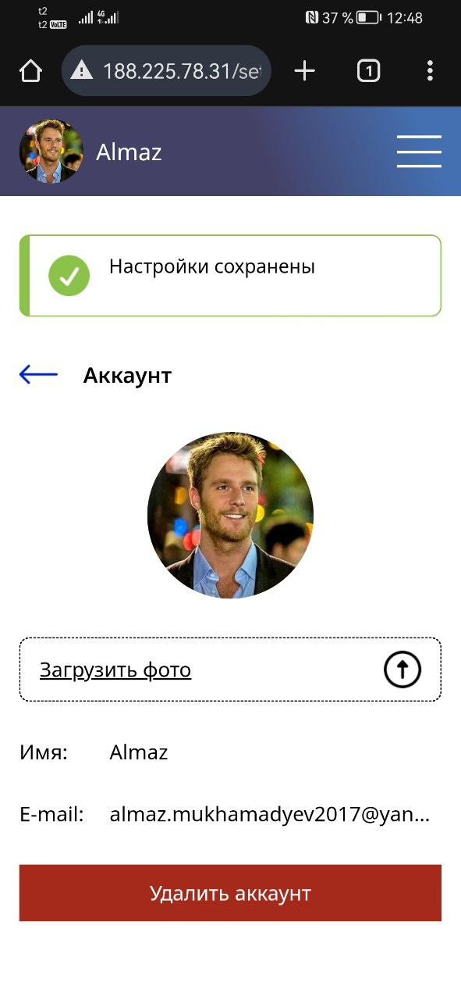
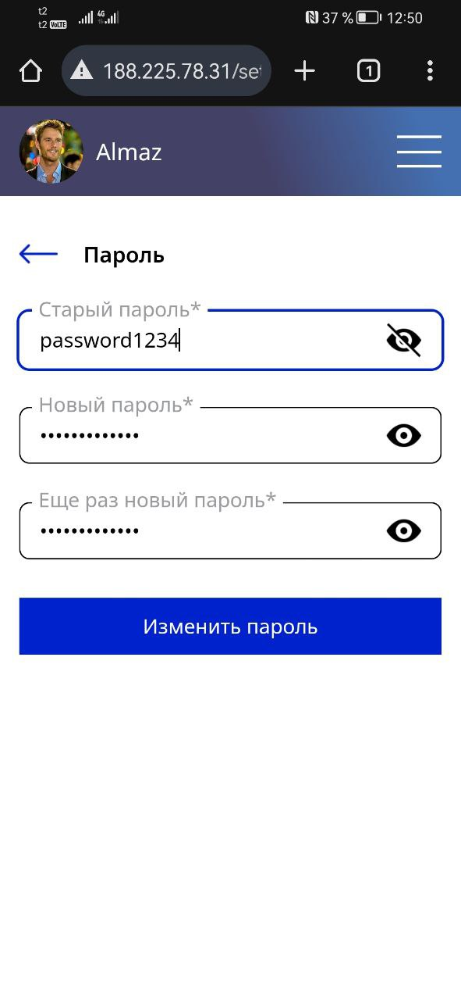

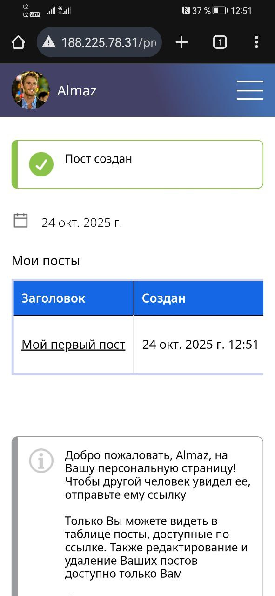

### Desktop
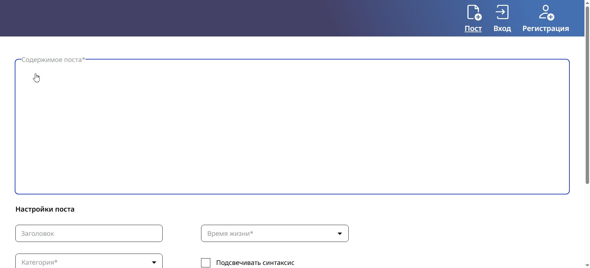
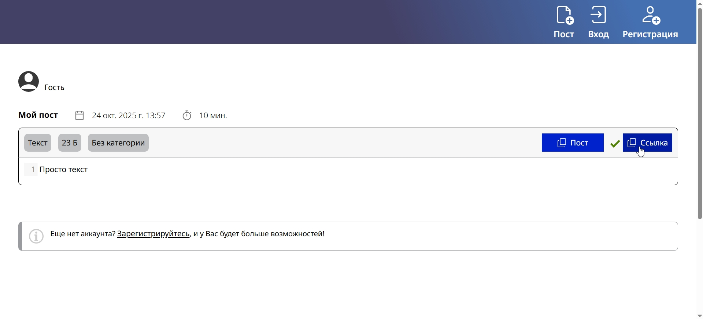
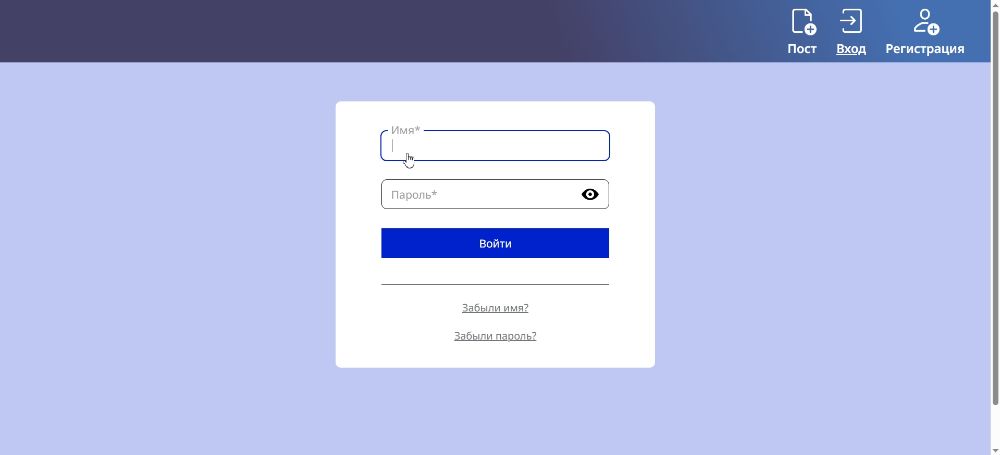
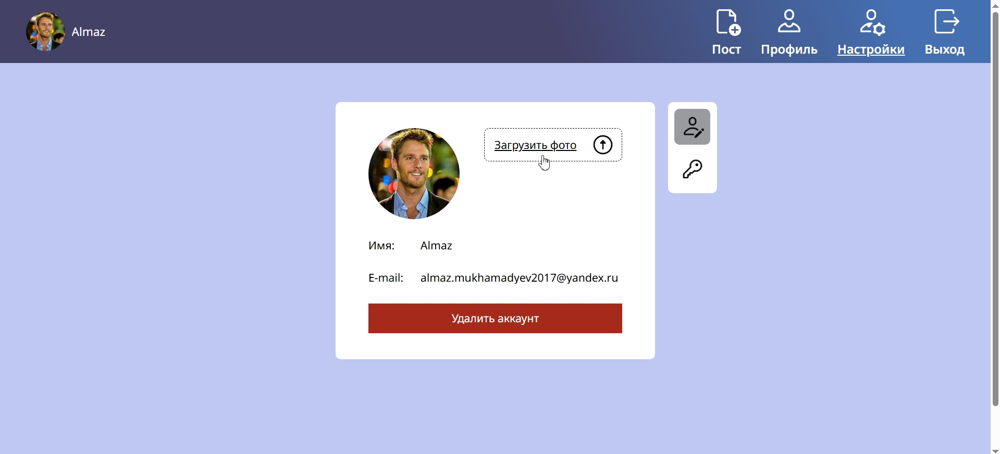
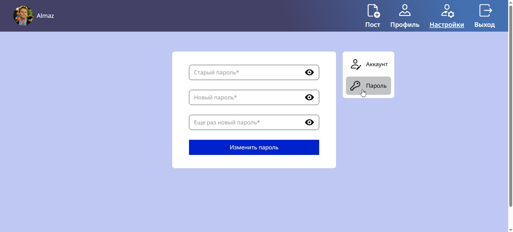
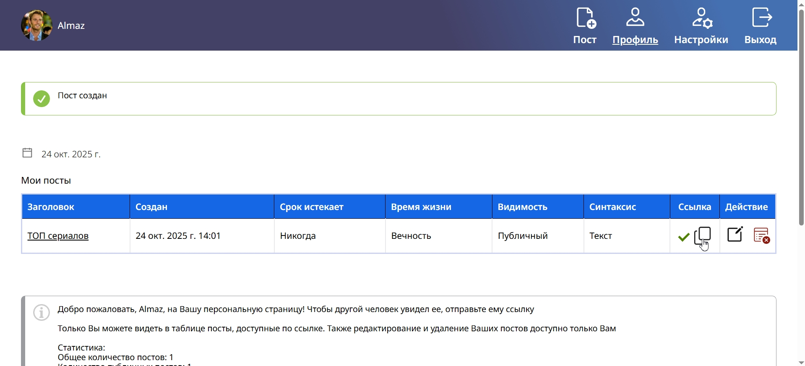

## Архитектура
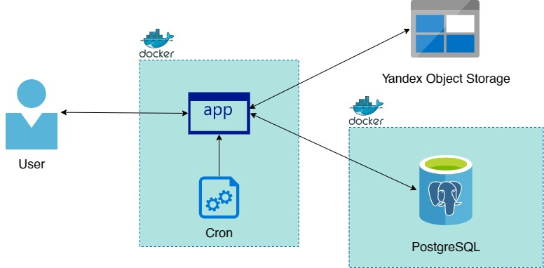

## Модель БД
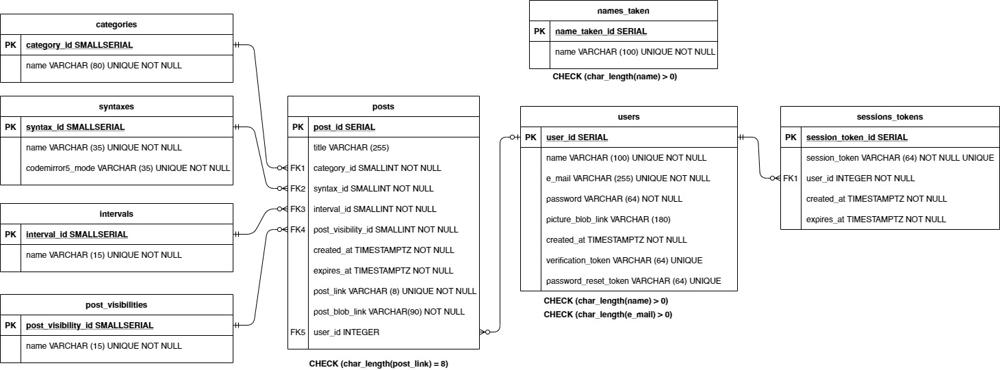

## Технологии и библиотеки
* Адаптивный дизайн (mobile-first)
* Методология БЭМ
* SOLID
* JS (CodeMirror 5)
* HTML, CSS
* PHP (PHPMailer, AWS-SDK-PHP, PHPDOTENV)
* Composer
* Apache
* PostgreSQL
* Yandex Object Storage
* Docker
* Cron
* CI/CD (GitHub Actions)

## Установка
0. Установите git и Docker
1. Перейдите в папку, в которую хотите скачать проект, и выполните команду "git clone https://github.com/NormalMood/Pastebin.git"
2. Откройте файл Pastebin/config/pastebin.conf и поменяйте сервер на localhost в строках "ServerName 188.225.78.31" и "ServerAdmin webmaster@188.225.78.31"
3. Откройте файл Pastebin/Dockerfile и поменяйте сервер на localhost в строке 'RUN echo "ServerName 188.225.78.31" >> /etc/apache2/apache2.conf'
4. Переименуйте файл .env-example в .env
5. При желании можете поменять AUTH_SALT в файле .env на свой
6. В любом S3 совместимом хранилище создайте публичный бакет "pastebin-pictures-bucket" для аватарок пользователей и приватный бакет "pastebin-posts-bucket" для постов
7. Укажите в файле .env свои значения AWS_ACCESS_KEY_ID и AWS_SECRET_ACCESS_KEY от своего каталога в S3
8. Создайте сервисный аккаунт в GMail и укажите SMTP_USER и SMTP_PASS в файле .env
9. Перейдите в корневую папку проекта и выполните команду "docker compose up"

## Использование
Откройте [http://localhost](http://localhost)

## Дальнейшее развитие
* Некоторые пользователи будут создавать много постов, поэтому приложение будет заранее генерировать уникальные ссылки к постам и, при необходимости, брать их из Redis.
* Популярные посты будут кешироваться в Redis

## Контакты автора
Email - almaz.mukhamadyev2017@yandex.ru 
Телефон - 89922118918 
Телеграм - @mukhamadyev